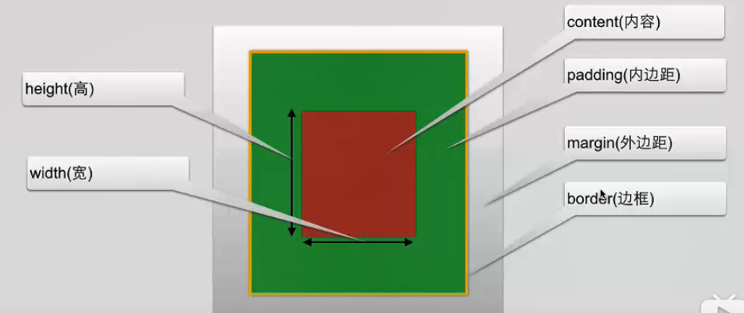
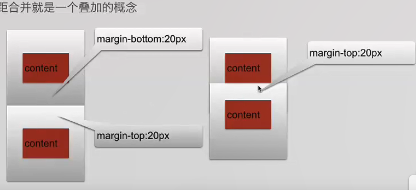

### CSS学习
* 样式顺序
内联样式）Inline style > （内部样式）Internal style sheet >（外部样式）External style sheet > 浏览器默认样式
* 文本修饰
  text-shadow: 5px 5px 2px #ffcc00; left 5px  top 5px 模糊2px 颜色#ffcc00
  text-wrap: normal 文本换行
  text-decoration:overline; line-through; underline;表示在文本上部中间和下部加线 一般用于连接文本
  text-transform:uppercase; lowercase; capitalize; 代表全部大写 全部小写  和首字母大写
  letter-spacing 设置文本间距 
  word-spacing 设置字间距
  font-style:normal; italic; 文本正常显示 斜体显示 
* 链接
  a:link{color:#000000} 代表未访问时的颜色 可以设置更多
  a:visited {} 访问后的状态 
  a:hover {} 鼠标放到上面的状态 
  a: active{} 点击时状态
  text-decoration: none 去除下划线
* 列表
  ul {list-style-type:circle/square} 标记的符号
  ol {list-style-type:upper-roman/lower-alpha} 罗马数字和英文字符
  list-style-image: url('sqpurple.gif'); 加图像属性
* table
  设置边框时设置table属性border-collapse:collapse属性 边框不会有两层
  控制td或th边框距离使用 padding属性 
  margin是自身边框到另一个容器边框的距离，容器外距离
  padding是自身边框到自身内部另一个同期边框的距离，容器内距离
  padding设置为负数无效
* Css盒子模型
  margin外边距、border边框、padding内边距、content内容
  
  外边距合并（根据数值大的div去判定100px 50px 则margin为100px）
  
* css position定位
  元素可以使用left,right,left,top进行定位，但首先设定position属性
  static时 偏移量对元素不起效果
  fixed固定 界面移动 但是此元素的位置是固定的
  relative相对定位  移动元素，但原本占有的空间不会改变 被用来作为绝对定位元素的容器
  absolute绝对定位  相对于最近的已定位父元素，如果没有，就像对于html元素
  z-index：-1指定元素的堆叠顺序 在其他元素后面 谁大就谁在前面
  css overflow控制内容溢出时的操作
  hidden 外部内容不可见 scroll 添加滚动条
* css浮动
  设置浮动元素原来的位置就会丢失 由下方的元素占用
  浮动可以使块级元素并排显示，用于页面布局
  某个元素设置浮动，同级元素都需要设置浮动
* css选择器
  ID选择器只能使用一次，而类选择器可以多次使用
  ID选择器不能结合使用
  当使用js的时候，需要用到id
* 对齐 
  元素水平居中 margin:auto 需要设置宽度，不然没用 
  字体直接使用text-align
  非块级元素居中 需要使用display:block转换为块级元素
  使用position时，需要设置body的margin和padding属性
* 导航栏
  垂直导航栏 ul中li设置display：block属性 a标签设置hover或active这些属性
  水平导航栏 li设置float：lefet属性 a标签设置未display：block为块级元素，
  li设置dispaly：inline时 a标签不设置dispaly属性 显示效果较差
  固定导航栏 position设置为fixed属性 top0 bottom0设置为顶部或底部

  下拉菜单 html dropdown设置a、button等的click或hover dropdown-content设置需要下拉的内容
  css设置dropdown为position：relative，dropdown-content为隐藏
  :hover或：active时显示下拉
  透明度使用opacity属性
* css3动画2D、3D转换
  2D转换translate() rotate() scale() skew() matrix()
  3D rotateX() rotateY()
  -webkit-transform:translate(200px,100px) // safari chrome内核
  -ms-transform:translate(200px,100px) // 支持IE
  -o-transform:translate(200px,100px) // 支持ipera
  -moz-transform:translate(200px,100px) // 支持Firefox
  transform:rotate(200deg) // 旋转
  transform:scale(1,2) // 缩小 放大 1，2指倍数
  transform:skew(20deg,50deg) // 倾斜
* css过渡
  一种样式变为另一种样式
  transtion四个过渡属性 transtion-property 过渡名称 transition-duration 过渡时间 transition-timing-function 过渡效果时间曲线 transition-delay 过渡效果开始时间
  transtion: width 2s, height 2s, transform 2s
* css动画
  animation: anim 5s; 动画名称
  @keyframes anim {
    0% {}
    25% {}
    50% {}
    75% {}
    100% {}
  }
* css3多列
  可以创建多列对文本或者区域进行布局
  属性 column-count column-gap column-rule
  column-count：3指定显示3列
	column-gap：40px 指定每列之间的间隙
	column-rule-style:solid指定边框
	column-rule-width：1px指定边框厚度
	column-rule-color:lightblue指定边框颜色
	column-rule：1px solid lightblue;
  css3圆角 border-radius:2px;
  css3盒子阴影 box-shadow
  css3边界图片 border-image
  css3渐变 线性渐变上下左右对角  径向渐变 中心向外
  linear-gradient(red,yellow) 从上到下的渐变
  linear-gradient(left,red,yellow) 从左到右的渐变